=====
Usage
=====

blackwhite
==========

The `blackwhite` subcommand converts color images to black and white.

Assuming image `rainbow.jpg` in the current directory, `blackwhite` can
be applied to output to `img_0000.jpg` as follows:

.. code-block:: console

    ls rainbow.jpg | imgwrench blackwhite

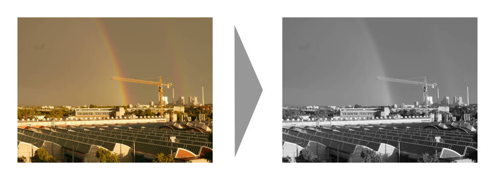

At the moment, `blackwhite` supports no further parameters. Conversion
is delegated to the PIL `convert('L')` method call.

collage
=======

The `collage` subcommand creates a collage of all input images. The method
for image composition is based on the `Blocked Recursive Image Composition (BRIC)`
algorithm by C. Brian Atkins..

Assuming a couple of images in the current directory, `collage` generates a collage
in `img_0000.jpg` as follows:

.. code-block:: console

    ls *.jpg | imgwrench collage -c lightgrey

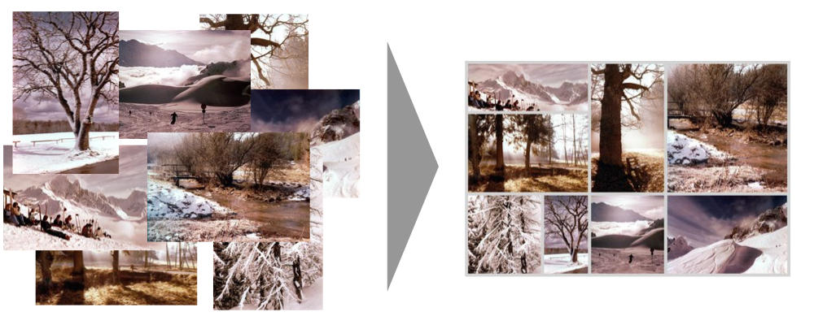

:code:`-w/--width` and :code:`-s/--height` can be used to specify the dimensions
of the output image. The parameter :code:`-f/--frame-width` specifies the frame width
as fraction of the longer image side, e.g. 0.1 for a frame width that is equal
to 10% of the longer image side. Also :code:`-c/--color` is supported which accepts
the frame color as either a name (e.g. :code:`white`, :code:`green`), a hex value (e.g.
:code:`#ab1fde`) or an rgb function value (e.g. :code:`rgb(120,23,217)`).

.. code-block:: console

    Usage: imgwrench collage [OPTIONS]

    Create a collage from multiple images.

    Options:
    -w, --width INTEGER         width of the collage  [default: 3072]
    -s, --height INTEGER        height of the collage  [default: 2048]
    -f, --frame-width FLOAT     width of the frame as a fraction of the longer
                                image side  [default: 0.01]

    -c, --color COLOR           color of the frame as a color name, hex value or
                                in rgb(...) function form  [default: white]

    -x, --seed INTEGER          seed for random number generator  [default: 123]
    -n, --number-tries INTEGER  number of tries for layout generation  [default:
                                100]

    --help                      Show this message and exit.

colorfix
========

The `colorfix` subcommand repairs aged images with a color shift (usually towards
red) by shifting the channel histograms back to the full range.

Assuming image `old.jpg` in the current directory, `colorfix` can be applied to
repair its colors and output as `img_0000.jpg` as follows:

.. code-block:: console

    ls old.jpg | imgwrench colorfix

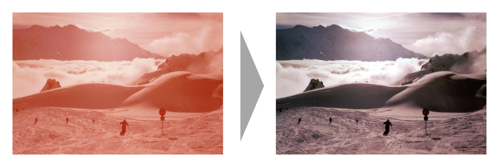

The `colorfix` algorithm stretches the channel histogram to specified clipping
values (cutoffs). The precise specification depends on the :code:`-m/--method` option.

:code:`--method=quantiles` supports the float parameter :code:`-a/--alpha`
representing the quantile
within each color channel that is clipped to the minimum and maximum value.
It defaults to :code:`0.01`. Increasing :code:`alpha` will stretch the histogram further
and will intensify the contrast of the resulting image.

:code:`--method=fixed-cutoff` lets you specify the cutoff colors directly as named color,
hex value or in rgb(...) function form. Use :code:`-l/--lower-cutoff` and
:code:`-u/--upper-cutoff` to specify.

:code:`--method=quantiles-fixed-cutoff` combines the other two methods and applies the
"stronger" cutoff (i.e. the higher value of lower cutoffs and lower value of
upper cutoffs).

.. code-block:: console

    Usage: imgwrench colorfix [OPTIONS]
    
      Fix colors by stretching channel histograms to full range.
    
    Options:
      -m, --method [quantiles|fixed-cutoff|quantiles-fixed-cutoff]
                                      algorithm method to use; quantiles stretches
                                      all channel histograms between the quantiles
                                      specified by --alpha; fixed-cutoff stretches
                                      channels between the cutoffs specified by
                                      --lower-cutoff and --upper-cutoff;
                                      quantiles-fixed-cutoff combines the two
                                      methods and applies the "stronger" of both
                                      cutoffs (i.e. the higher value of lower
                                      cutoffs and lower value of upper cutoffs)
                                      [default: (dynamic)]
      -a, --alpha FLOAT               quantile (low and high) to be clipped to
                                      minimum and maximum color; relevant for
                                      --method=quantiles and --method=quantiles-
                                      fixed-cutoff  [default: 0.01]
      -l, --lower-cutoff COLOR        lower cutoff as a color name, hex value or
                                      in rgb(...) function form; relevant for
                                      --method=fixed-cutoff and
                                      --method=quantiles-fixed-cutoff  [default:
                                      rgb(127,0,0)]
      -u, --upper-cutoff COLOR        lower cutoff as a color name, hex value or
                                      in rgb(...) function form; relevant for
                                      --method=fixed-cutoff and
                                      --method=quantiles-fixed-cutoff  [default:
                                      white]
      --help                          Show this message and exit.

crop
====

The `crop` subcommand crops images to a specified aspect ratio.

Assuming image `rainbow.jpg` in the current directory, `crop` can be applied
with aspect ratio 2:1 and output to `img_0000.jpg` as follows:

.. code-block:: console

    ls rainbow.jpg | imgwrench crop -a 2:1

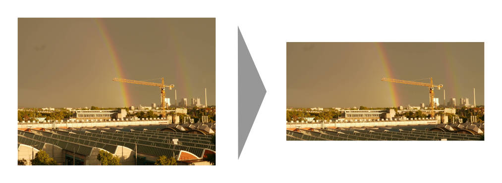

`crop` supports the parameter :code:`-a/--aspect-ratio` which has to be an aspect ratio
specified as two numbers separated by a colon, e.g. :code:`2:1`, :code:`3:4`, :code:`117:123`.

.. code-block:: console

    Usage: imgwrench crop [OPTIONS]

    Crop images to the given aspect ratio.

    Options:
    -a, --aspect-ratio RATIO  aspect ratio to crop to  [default: 3:2]
    --help                    Show this message and exit.

dither
======

The `dither` command converts the image to true black and white (not greyscale)
and applies dithering.

Assuming image `lensflare.jpg` in the current directory, `dither` can be applied
to output `img_0000.jpg` as follows:

.. code-block:: console

    ls lensflare.jpg | imgwrench dither

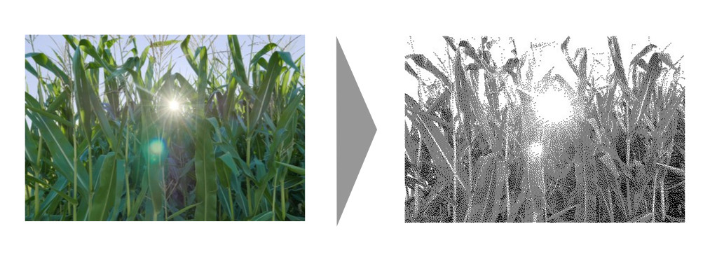

The parameter :code:`-b/--brightness-factor` adjusts the brightness of the image before dithering.
It is usually recommended to make images brighter before dithering. A value of 1.0 is
neutral (i.e. has no effect), larger values will make the image brighter, smaller values
will make it darker. It defaults to 1.5.

.. code-block:: console

    Usage: imgwrench dither [OPTIONS]

    Apply black-white dithering to images.

    Options:
    -b, --brightness-factor FLOAT  adjust brightness before dithering (1.0 is
                                    neutral, larger is brighter, smaller is
                                    darker)  [default: 1.5]
    --help                         Show this message and exit.

filmstrip
==========

The `filmstrip` command stacks all images in the pipeline horizontally to create
a filmstrip within a single row. Assuming a couple of images in the current directory,
`filmstrip` will create a single output image `img_0000.jpg` width height 800 pixels
as follows:

.. code-block:: console

    ls *.JPG | imgwrench filmstrip -s 800

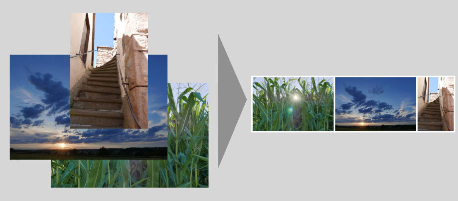

The parameter :code:`-s/--height specifies` the total height of the resulting collage,
its width will be inferred. :code:`-w/--frame-width` determines the frame width relative
to the specified height and :code:`-c/--color` sets the frame color.

.. code-block:: console

    Usage: imgwrench filmstrip [OPTIONS]

    Stack all images horizontally, creating a filmstrip.

    Options:
    -s, --height INTEGER     height of the filmstrip  [default: 2048]
    -w, --frame-width FLOAT  width of the frame as a fraction of the height  of
                            the filmstrip  [default: 0.025]
    -c, --color COLOR        color of the frame as a color name, hex value or in
                            rgb(...) function form  [default: white]
    --help                   Show this message and exit.

flip
====

The `flip` command flips (a.k.a. mirrors) all images in the pipeline horizontally,
i.e. what was left is now right and vice versa.

Assuming image `town.jpg` in the current directory, `flip` will output
the mirrored image to `img_0000.jpg` as follows:

.. code-block:: console

    ls town.jpg | imgwrench flip

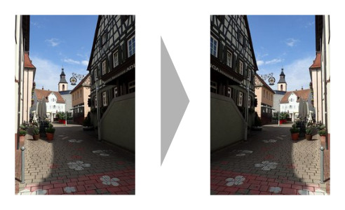

`flip` takes no parameters.

frame
=====

The `frame` subcommand puts a monocolor frame around the image. The frame is
added to the image size.

Assuming image `saarschleife.jpg` in the current directory, `frame` can
be applied with a frame width equal to 3% of the original image width (which
is in landscape format, i.e. width > height) and a light grey color
to output to `img_0000.jpg` as follows:

.. code-block:: console

    ls saarschleife.jpg | imgwrench frame -w 0.03 -c '#ddd'

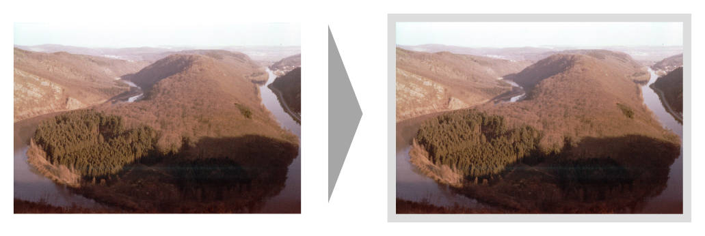

`frame` supports the parameter :code:`-w/--frame-width` which specifies the frame width
as fraction of the longer image side, e.g. 0.1 for a frame width that is equal
to 10% of the longer image side. Also :code:`-c/--color` is supported which accepts
the frame color as either a name (e.g. :code:`white`, :code:`green`), a hex value (e.g.
:code:`#ab1fde`) or an rgb function value (e.g. :code:`rgb(120,23,217)`).

.. code-block:: console

    Usage: imgwrench frame [OPTIONS]

    Put a monocolor frame around images.

    Options:
    -w, --frame-width FLOAT  width of the frame as a fraction of the longer
                            image side  [default: 0.025]
    -c, --color COLOR        color of the frame as a color name, hex value or in
                            rgb(...) function form  [default: white]
    --help                   Show this message and exit.

framecrop
=========

The `framecrop` command crops and frames an image to a target aspect ratio.
The resulting image will conform to the target aspect ratio so you don't have
to precompute the required crop ratio.

Assuming image `rainbow.jpg` in the current directory, `framecrop` can be applied
with aspect ratio 3:2, a grey frame of width 10% and output to `img_0000.jpg` as follows:

.. code-block:: console

   ls rainbow.jpg | imgwrench framecrop -a '3:2' -w 0.1 -c grey

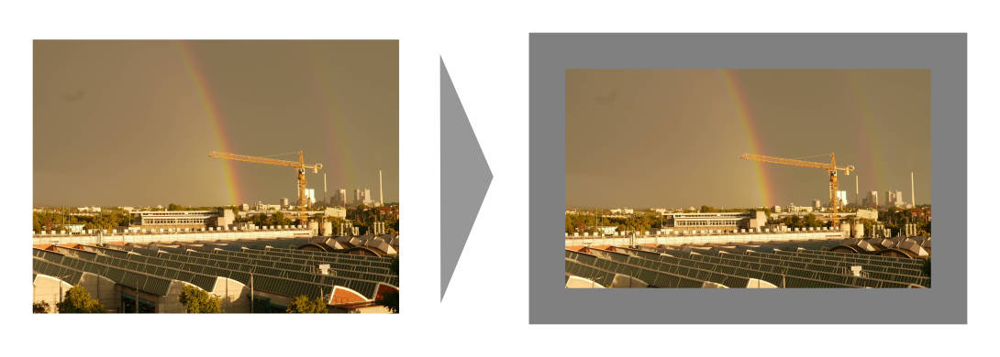

`framecrop` supports the parameter :code:`-a/--aspect-ratio` which has to be an aspect ratio
specified as two numbers separated by a colon, e.g. :code:`2:1`, :code:`3:4`, :code:`117:123`. This will
be the ratio of the final image *including* the frame.

The parameter :code:`-w/--frame-width` specifies the frame width as fraction of the longer
image side after the crop operation. Also :code:`-c/--color` is supported which accepts
the frame color as either a name (e.g. :code:`white`, :code:`green`), a hex value (e.g.
:code:`#ab1fde`) or an rgb function value (e.g. :code:`rgb(120,23,217)`).

.. code-block:: console

    Usage: imgwrench framecrop [OPTIONS]

    Crop and frame an image to a target aspect ratio.

    Options:
    -a, --aspect-ratio RATIO  aspect ratio of final image including frame
                                [default: 3:2]
    -w, --frame-width FLOAT   width of the frame as a fraction of the longer
                                side of the cropped image  [default: 0.025]
    -c, --color COLOR         color of the frame as a color name, hex value or
                                in rgb(...) function form  [default: white]
    --help                    Show this message and exit.

quad
====

The `quad` command creates grids consisting of four images. The primary use case
is batch creation of small prints. Images are rotated in order to minimize the area cropped away,
i.e. landscape images are rotated if the target image has portrait aspect ratio and
portrait images are rotated if the target image has landscape aspect ratio.

.. code-block:: console

   ls *.jpg | imgwrench quad

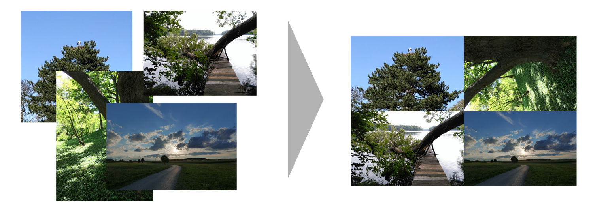

`quad` automatically creates the correct amount of target images and leaves remaining space blank
(color can be specified using :code:`--color`). Also, the usual :code:`--width`, :code:`--height`
and :code:`--frame-width` options are supported.

.. code-block:: console

    Usage: imgwrench quad [OPTIONS]

    Collects four images to a quad.

    Options:
    -w, --width INTEGER       width of the quad image  [default: 3072]
    -s, --height INTEGER      height of the quad image  [default: 2048]
    -f, --frame-width FLOAT   width of the frame as a fraction of the longer
                                side of the output image  [default: 0.0]

    -d, --double-inner-frame  double inner frame width for even cuts
    -c, --color COLOR         color of the frame as a color name, hex value or
                                in rgb(...) function form  [default: white]

    --help                    Show this message and exit

resize
======

The `resize` command resizes images to a maximum side length while preserving the
original aspect ratio.

Assuming image `lensflare.jpg` in the current directory, `resize` can be applied
with a maximum side length of 300 pixels to `img_0000.jpg` as follows:

.. code-block:: console

    ls lensflare.jpg | imgwrench resize -m 300

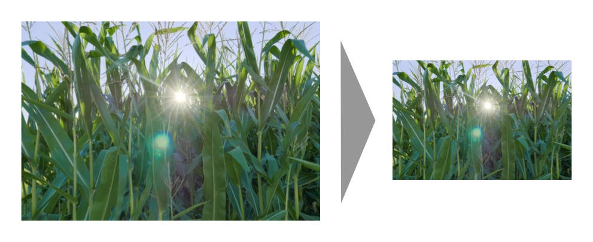

The parameter :code:`-m/--maxsize` specifies the new maximum side length of the resized
image, i.e. for landscape images it specifies the new width and for portrait
images it specifies the new height.

.. code-block:: console

    Usage: imgwrench resize [OPTIONS]

    Resize images to a maximum side length preserving aspect ratio.

    Options:
    -m, --maxsize INTEGER  size of the longer side (width or height) in pixels
                            [default: 1024]
    --help                 Show this message and exit.

stack
=====

The `stack` command stacks pairs of images vertically.

Assuming image `sky.jpg` and `sunset.jpg` in the current directory,
`stack` can be applied with a target width of 400 and height 600 pixels
to output to `img_0000.jpg` as follows:

.. code-block:: console

    ls sky.jpg sunset.jpg | imgwrench stack -w 400 -s 600

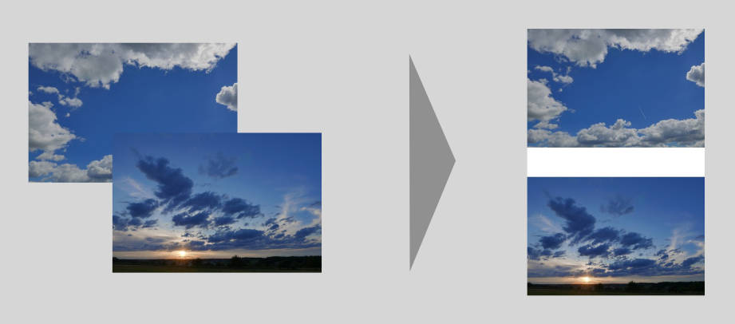

The parameters :code:`-w/--width` and :code:`-s/--height` (attention: it is :code:`-s`, not :code:`-h` to avoid
conflicts with :code:`--help`) specify the target width and height of the output image.
Remaining space will be white.

.. code-block:: console

    Usage: imgwrench stack [OPTIONS]

    Stack images vertically, empty space in the middle.

    Options:
    -w, --width INTEGER   width of the stacked image  [default: 2048]
    -s, --height INTEGER  height of the stacked image  [default: 3072]
    --help                Show this message and exit.
